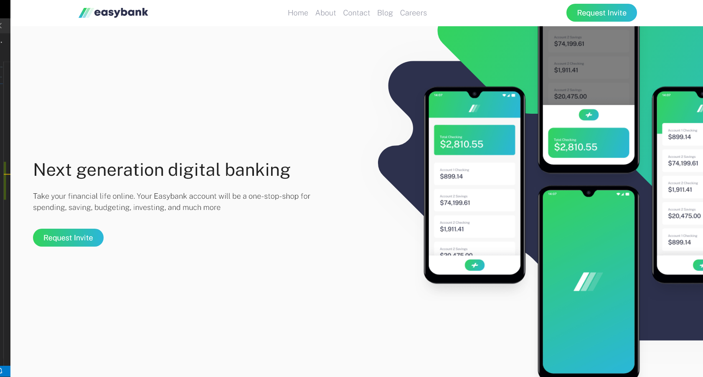
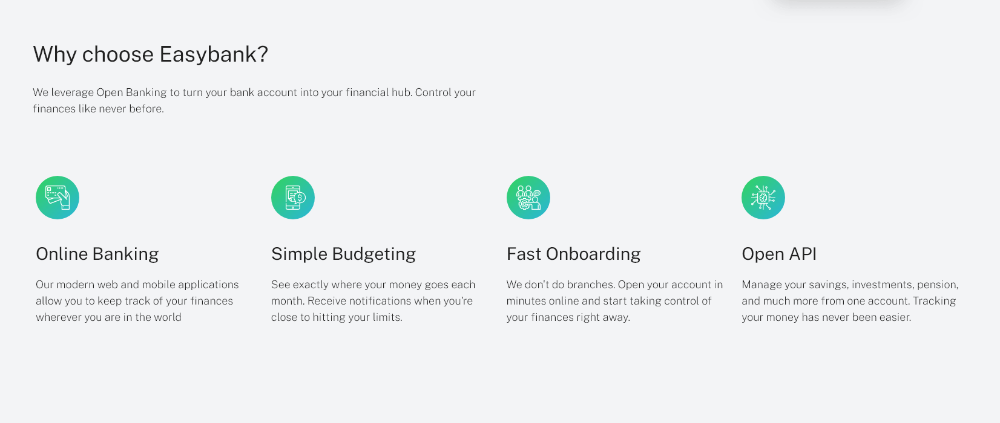
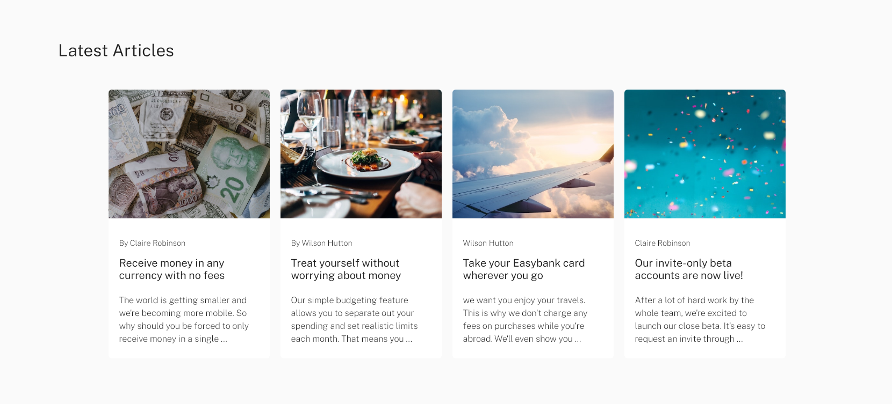

# Frontend Mentor - Easybank landing page solution

This is a solution to the [Easybank landing page challenge on Frontend Mentor](https://www.frontendmentor.io/challenges/easybank-landing-page-WaUhkoDN). Frontend Mentor challenges help you improve your coding skills by building realistic projects. 

## Table of contents

- [Overview](#overview)
  - [The challenge](#the-challenge)
  - [Screenshot](#screenshot)
  - [Links](#links)
- [My process](#my-process)
  - [Built with](#built-with)
  - [What I learned](#what-i-learned)
  - [Continued development](#continued-development)
  - [Useful resources](#useful-resources)
- [Author](#author)
- [Acknowledgments](#acknowledgments)

**Note: Delete this note and update the table of contents based on what sections you keep.**

## Overview

### The challenge

Users should be able to:

- View the optimal layout for the site depending on their device's screen size
- See hover states for all interactive elements on the page

### Screenshot

### Links

- Solution URL: [Add solution URL here](https://johangly.github.io/easybank-landing-page-master/)
- Live Site URL: [Add live site URL here](https://johangly.github.io/easybank-landing-page-master/)

## My process
Hello, my name is Johangly and i use Bootstrap and flexbox, i do this in 8 hours.
### Built with

- Semantic HTML5 markup
- CSS custom properties
- Flexbox
- Bootstrap 
- SASS
### What I learned

i go to do first-mobile because is better and more fast what first-desktop
### Continued development

I want to do more practice for my portfolio and get more experience
### Useful resources

- [Example resource 1](https://html-css-js.com/css/generator/box-shadow/)
## Author

- Website - [Add your name here](for now i not have one, i working in that)

- Frontend Mentor - [@Johangly Sucre](https://www.frontendmentor.io/profile/johangly)

- Twitter - [@johangly1004](https://twitter.com/johangly1004)

## Acknowledgments

listen to music, that help much and use more grid :)
i hope whats help you.
